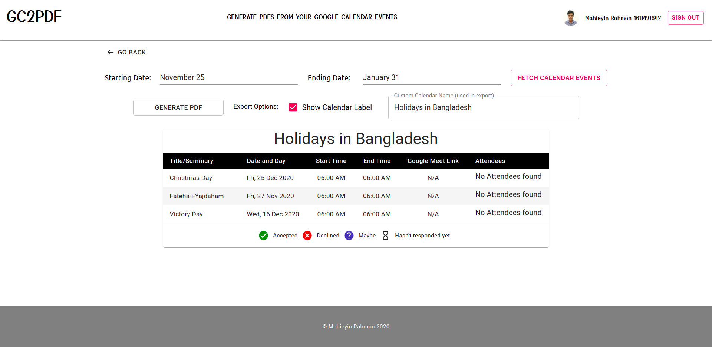

# GC2PDF: Download Google Calendar Events in PDF

A utility web app that allows the users to log in to their Google accounts, fetch their Google Calendar events and download them in the form of PDF.

### Note: Currently, I am working on getting the app verified by Google, so that it can be used by everyone. As such, it is currently available to a limited number of test users.

## Tech stack
- Next.js
- Material UI
- CSS Grid

## Screenshots

